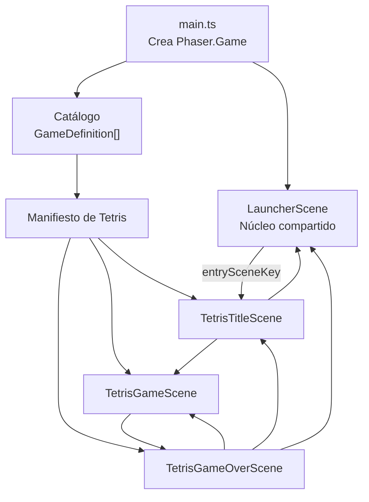
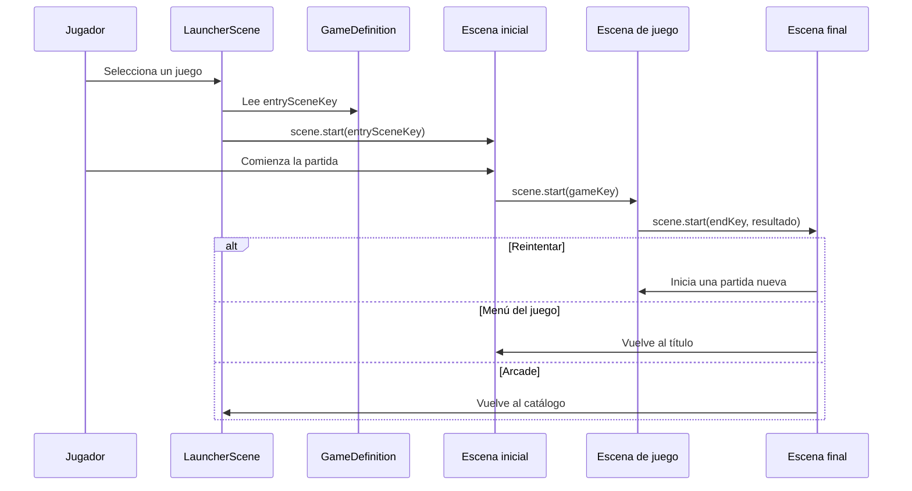
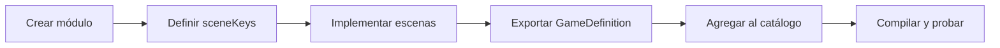
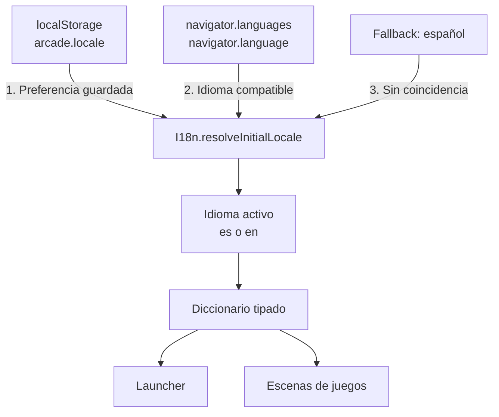
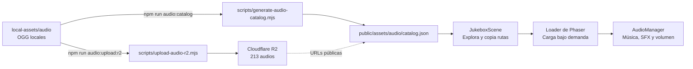

# Mi Arcade con Phaser

Proyecto personal para aprender desarrollo de videojuegos con Phaser y TypeScript.
La aplicación funciona como un pequeño arcade: comienza en un launcher común y
cada juego se instala como un módulo independiente con sus propias escenas,
objetos, reglas y documentación.

Actualmente incluye Tetris, Truco, Pipes, Astro Chess —en construcción, con su
diseño ya documentado— y Jukebox, una herramienta interna para
probar la biblioteca de música y efectos.

## Puesta en marcha

Requisitos:

- Node.js 22 o compatible.
- npm 12 o compatible.

Comandos disponibles:

```bash
npm install
npm run dev
npm run build
npm run shots
npm run sim:astro
npm run audio:catalog
npm run audio:upload:r2
npm run deploy:pages
npm run preview
```

- `npm run dev` inicia el entorno de desarrollo con recarga automática.
- `npm run build` valida TypeScript y genera la versión de producción.
- `npm run shots` recorre el arcade en un Chrome headless y deja capturas.
- `npm run sim:astro` juega cientos de combates de Astro Chess sin navegador
  para medir el balance.
- `npm run audio:catalog` reconstruye el catálogo después de agregar audio.
- `npm run audio:upload:r2` sincroniza los OGG locales con Cloudflare R2.
- `npm run deploy:pages` compila y publica el arcade en Cloudflare Pages.
- `npm run preview` permite revisar localmente el build de producción.

## Verificación en el navegador

`npm run build` valida los tipos, no lo que se ve. Un color invisible, dos
siluetas iguales o un botón tapado compilan perfecto. `npm run shots` levanta el
servidor de desarrollo, recorre el arcade en un Chrome headless y deja las
capturas en `screenshots/`, que no se versiona.

```bash
npm run shots                 # launcher y Astro Chess
npm run shots -- astro-chess  # sólo un recorrido
npm run shots -- --show       # con ventana visible
ARCADE_PORT=5180 npm run shots  # si el 5173 lo usa otro proyecto
```

Los recorridos viven en `scripts/screenshots.mjs` y el driver en
`scripts/arcade-driver.mjs`. Agregar un recorrido es agregar una función a
`FLOWS`.

Cuatro decisiones y dos trampas que conviene conocer antes de tocarlo:

- Se usa `playwright-core`, no `playwright`: el primero pesa unos megas y maneja
  el Chrome ya instalado (`channel: 'chrome'`); el segundo descargaría sus
  propios navegadores.
- Dentro de un canvas no hay selectores. Todo se maneja con teclado,
  coordenadas y capturas.
- Una captura prueba que algo se dibujó, no que sea la pantalla correcta. Por
  eso `main.ts` publica el juego en `window.arcade` **sólo en desarrollo** y
  cada paso espera la clave de la escena activa en vez de dormir a ciegas.
- La página se abre con densidad 2 (`deviceScaleFactor`), como un monitor
  HiDPI, para ejercitar el zoom de `core/renderScale.ts`. Las capturas salen de
  1600×1200, pero los clicks se siguen dando en coordenadas de 800×600.
- Las teclas se mantienen apretadas 80 ms. `Key.onUp` de Phaser borra el
  `justDown`, así que una tecla apretada y soltada en el mismo frame no llega
  nunca a `update()` y se pierde sin dar error.
- El driver reutiliza el servidor que encuentre en el puerto, pero antes
  comprueba que sea el arcade (`<title>Mi Arcade</title>`). Si en el 5173 corre
  otro proyecto de Vite, se detiene con un error en vez de manejar la
  aplicación equivocada. En ese caso hay que usar `ARCADE_PORT`.

## Arquitectura general

Phaser crea un solo `Phaser.Game` y un solo canvas. Las distintas pantallas son
escenas que se registran al iniciar la aplicación y se activan según la
navegación del jugador.



El launcher no conoce la implementación interna de Tetris. Sólo lee su ficha y
la clave de su escena de entrada. Eso permite que un juego tenga una escena o
veinte sin volver más complejo al launcher.

## Estructura del proyecto

```text
src/
├── main.ts
├── style.css
│
├── core/
│   ├── gameCatalog.ts
│   ├── renderScale.ts
│   ├── sceneKeys.ts
│   ├── audio/
│   │   └── AudioManager.ts
│   ├── i18n/
│   │   ├── i18n.ts
│   │   └── translations.ts
│   └── scenes/
│       └── LauncherScene.ts
│
└── games/
    ├── tetris/
    │   ├── index.ts
    │   ├── sceneKeys.ts
    │   ├── tetris.md
    │   ├── constants/
    │   │   └── tetrominoes.ts
    │   ├── objects/
    │   │   └── Piece.ts
    │   └── scenes/
    │       ├── TetrisTitleScene.ts
    │       ├── TetrisGameScene.ts
    │       └── TetrisGameOverScene.ts
    ├── pipes/
    │   ├── index.ts
    │   ├── sceneKeys.ts
    │   ├── audio.ts
    │   ├── tuningStore.ts
    │   ├── pipes.md
    │   ├── constants/
    │   │   ├── pipeTypes.ts
    │   │   ├── levels.ts
    │   │   └── tuning.ts
    │   ├── objects/
    │   │   ├── PipeBoard.ts
    │   │   ├── PipeQueue.ts
    │   │   ├── WaterFlow.ts
    │   │   └── pipeRenderer.ts
    │   └── scenes/
    │       ├── PipesTitleScene.ts
    │       ├── PipesGameScene.ts
    │       ├── PipesRoundEndScene.ts
    │       └── PipesConfigScene.ts
    ├── astro-chess/
    │   ├── index.ts
    │   ├── sceneKeys.ts
    │   ├── audio.ts
    │   ├── astro-chess.md
    │   ├── constants/
    │   │   ├── pieces.ts
    │   │   ├── rooms.ts
    │   │   ├── enemies.ts
    │   │   └── tuning.ts
    │   ├── state/
    │   │   ├── rng.ts
    │   │   ├── Crew.ts
    │   │   ├── Ship.ts
    │   │   └── Combat.ts
    │   ├── objects/
    │   │   ├── pieceRenderer.ts
    │   │   ├── shipRenderer.ts
    │   │   ├── CrewBoard.ts
    │   │   ├── text.ts
    │   │   └── ui.ts
    │   └── scenes/
    │       ├── AstroChessTitleScene.ts
    │       ├── AstroChessShipScene.ts
    │       └── AstroChessCombatScene.ts
    └── jukebox/
        ├── index.ts
        ├── sceneKeys.ts
        ├── audioCatalog.ts
        ├── jukebox.md
        └── scenes/
            └── JukeboxScene.ts

public/assets/audio/
├── catalog.json
└── licenses/

local-assets/audio/       # Fuentes OGG locales; ignoradas por Git y Vite

cloudflare/
├── audio-assets.json
├── r2-cors.json
└── README.md

scripts/
└── generate-audio-catalog.mjs
```

### `core`

Contiene únicamente infraestructura compartida por el arcade:

- El launcher.
- El contrato `GameDefinition`.
- El catálogo de juegos instalados.
- Las claves de escenas que pertenecen al núcleo.

No se deben colocar reglas específicas de un juego dentro de `core`.

### `games`

Cada subcarpeta representa un juego autocontenido. Un módulo puede tener las
escenas, objetos, sistemas, constantes y assets que necesite.

El archivo `index.ts` es la interfaz pública del módulo. Exporta un manifiesto
que cumple este contrato:

```ts
export type GameDefinition = {
  id: string;
  titleKey: TranslationKey;
  descriptionKey: TranslationKey;
  controlsKey: TranslationKey;
  accentColor: number;
  coverType: 'tetris' | 'jukebox' | 'truco' | 'pipes' | 'astro-chess';
  entrySceneKey: string;
  scenes: Phaser.Types.Scenes.SceneType[];
};
```

## Flujo de navegación



Phaser ofrece varias operaciones útiles para juegos con más pantallas:

- `scene.start`: detiene la escena actual y abre otra.
- `scene.launch`: ejecuta otra escena en paralelo; por ejemplo, un HUD.
- `scene.pause` y `scene.resume`: pausa y reanuda una escena.
- `scene.sleep` y `scene.wake`: conserva una escena sin actualizarla.
- `scene.stop`: detiene explícitamente una escena.

## Cómo agregar otro juego

1. Crear `src/games/<nombre-del-juego>`.
2. Definir claves con un prefijo propio, como `snake:title` o `snake:game`.
3. Implementar las escenas necesarias.
4. Crear un `index.ts` que exporte su `GameDefinition`.
5. Agregar las traducciones de su ficha y pantallas para todos los idiomas.
6. Importar el manifiesto en `core/gameCatalog.ts`.
7. Agregarlo a `GAME_CATALOG`.
8. Documentar sus controles, mecánicas y decisiones dentro de su módulo.
9. Ejecutar `npm run build` y probar el recorrido completo en el navegador.



## Internacionalización

La interfaz está disponible en español e inglés. Los textos visibles no se
guardan directamente en las escenas ni en los manifiestos: se referencian con
claves tipadas definidas en `core/i18n/translations.ts`.



Orden de resolución:

1. Preferencia elegida previamente y guardada en `localStorage`.
2. Primer idioma compatible configurado en el navegador.
3. Español como fallback.

El selector ES/EN vive en el launcher. Al cambiarlo, se persiste
`arcade.locale` y se reinicia la escena del launcher para redibujar sus textos.
Las escenas que se abran después leen automáticamente el mismo idioma activo.

El diccionario español define el tipo `TranslationKey`. El diccionario inglés
debe satisfacer exactamente ese conjunto, por lo que TypeScript detecta claves
faltantes durante `npm run build`.

Para agregar un idioma:

1. Sumar su código a `SUPPORTED_LOCALES`.
2. Crear el diccionario completo en `translations.ts`.
3. Agregarlo a `TRANSLATIONS`.
4. Incorporar su opción en el selector del launcher.
5. Probar detección, selección, persistencia y todas las escenas.

### Evolución de la persistencia

`localStorage` es la opción adecuada mientras se guarden preferencias pequeñas
del dispositivo, como idioma, volumen o configuración de controles. No requiere
cuentas, servidor ni conexión.

Si más adelante aparecen partidas locales grandes, replays o muchos datos
estructurados, la alternativa del navegador es IndexedDB. Una base de datos en
un backend recién se justifica cuando necesitemos usuarios, sincronización entre
dispositivos, rankings compartidos o copias en la nube. En ese caso el juego se
comunicaría con una API autenticada; nunca accedería directamente a la base de
datos desde el cliente.

## Audio y Jukebox

Los OGG compartidos viven en Cloudflare R2. `public/assets/audio` conserva sólo
el catálogo y las licencias, mientras que las fuentes locales se guardan en
`local-assets/audio`, fuera de Git y del build. Los juegos consumen las URLs de
R2 declaradas en el catálogo y usan `AudioManager` para la política común.



El Jukebox está instalado como un juego más. Su módulo es autocontenido bajo
`src/games/jukebox`, pero delega en `core/audio/AudioManager.ts` aquello que sí
comparten todos los juegos: una única música activa, volúmenes separados y su
persistencia.

El launcher reproduce la pista `Week 1 - Retro Lounge BASE` desde
`src/core/audio/coreAudio.ts`. Se carga al entrar al arcade y se detiene al
salir hacia otro juego, manteniendo la música de cada pantalla aislada.

La escena sólo precarga el JSON del catálogo. Cada OGG se descarga al elegirlo,
evitando cargar toda la biblioteca al abrir el arcade. La ruta visible se puede
copiar con el botón **Copiar** o con `Ctrl+C` / `Cmd+C`; esa es la URL que debe
usarse al precargar el asset desde otra escena.

Los volúmenes se guardan en `localStorage`:

- `arcade.audio.musicVolume`
- `arcade.audio.sfxVolume`

Para sumar un pack, se lo descomprime en `local-assets/audio`, se conservan sus
archivos de licencia, se registra su colección en el generador y se ejecutan
`npm run audio:upload:r2` y `npm run audio:catalog`. El catálogo generado no
debe editarse a mano.

Componentes relevantes:

- `src/core/audio/AudioManager.ts`: política compartida de reproducción.
- `src/core/audio/coreAudio.ts`: música de las pantallas compartidas, incluida
  la del launcher.
- `src/games/jukebox`: manifiesto, escena, tipos y documentación del Jukebox.
- `local-assets/audio`: fuentes pesadas locales, ignoradas por Git y Vite.
- `public/assets/audio`: licencias y catálogo generado.
- `cloudflare`: bucket, URL pública, CORS y operación de R2.
- `scripts/generate-audio-catalog.mjs`: reconstrucción reproducible del catálogo.
- `scripts/upload-audio-r2.mjs`: sincronización de OGG mediante Wrangler.
- `tools/audio/abstraction-song-browser`: navegador original del bundle,
  conservado como herramienta externa y fuera del runtime del juego.

## Despliegue y caché

El arcade está publicado en [phaser-arcade.pages.dev](https://phaser-arcade.pages.dev/).
Cloudflare Pages y R2 se despliegan por separado:

1. `npm run audio:upload:r2` actualiza los objetos pesados.
2. `npm run audio:catalog` calcula versiones desde el contenido.
3. `npm run deploy:pages` publica código y catálogo.

`index.html` y `catalog.json` usan `must-revalidate`. Los archivos JS/CSS de
Vite tienen hash en el nombre y los OGG llevan `?v=<hash>`, por lo que pueden
usar caché inmutable durante un año. En un despliegue normal no se purga caché:
todo contenido modificado obtiene una URL diferente.

## Nitidez del canvas

Las escenas se diseñan en 800×600, pero el canvas se crea con los píxeles que
realmente ocupará en pantalla (ventana × densidad del monitor). Si se dibujara
a 800×600 y el navegador lo estirara, los textos chicos y los trazos finos se
verían borrosos. `core/renderScale.ts` calcula esa escala al arrancar y un
plugin de escena hace zoom en la cámara principal y rasteriza cada `Text` a la
misma resolución. `roundPixels` evita además posiciones en medio píxel.

Para las escenas esto es transparente, salvo en tres casos:

- `pointer.x` y `pointer.y` están en píxeles del canvas. Para coordenadas de la
  escena se usan `pointer.worldX` y `pointer.worldY`.
- Una cámara adicional (`cameras.add`) recibe su viewport en píxeles del canvas
  y necesita `setOrigin(0).setZoom(RENDER_SCALE)`, como el visor de la
  configuración de Pipes.
- `setCrop` sobre un `Text` se mide en píxeles de su textura: hay que
  multiplicar por `text.style.resolution`, como en la bitácora de Astro Chess.

## Estado y representación visual

La lógica del juego no debe depender de sus objetos visuales. Por ejemplo, en
Tetris la matriz `board` es el estado real y los `Rectangle` de Phaser son sólo
su representación en pantalla.

Esta separación permite:

- Probar reglas sin depender del renderizado.
- Redibujar la pantalla sin alterar la partida.
- Cambiar gráficos sin reescribir colisiones o puntaje.
- Compartir resultados entre escenas mediante objetos simples.

Las escenas de Phaser se reutilizan. Todo estado de una partida nueva debe
reiniciarse explícitamente desde `create` o desde un método llamado por éste.

## Convenciones

- Las claves de escenas usan prefijos: `core:*`, `tetris:*`, etcétera.
- Los assets futuros también deben usar claves con prefijo.
- Ningún texto visible debe quedar escrito directamente en una escena.
- Todo idioma debe implementar el conjunto completo de `TranslationKey`.
- Los comentarios explican conceptos, decisiones y mecánicas; no repiten código
  evidente.
- Las abstracciones compartidas se crean cuando existe más de un consumidor
  real, no anticipadamente.
- Todo juego mantiene su documentación junto a su código.
- Después de cada cambio se ejecuta `npm run build`.

## Documentación adicional

- [Reglas para asistentes y mantenimiento](AGENTS.md)
- [Diseño técnico y funcionalidades de Tetris](src/games/tetris/tetris.md)
- [Diseño técnico y funcionalidades de Pipes](src/games/pipes/pipes.md)
- [Diseño y plan de implementación de Astro Chess](src/games/astro-chess/astro-chess.md)
- [Diseño técnico y funcionalidades del Jukebox](src/games/jukebox/jukebox.md)
- [Biblioteca, licencias y procedimiento de audio](public/assets/audio/README.md)
- [Infraestructura y operación de Cloudflare R2](cloudflare/README.md)
