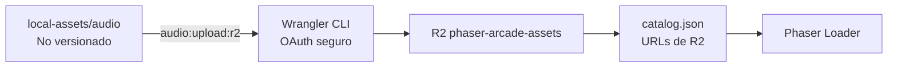
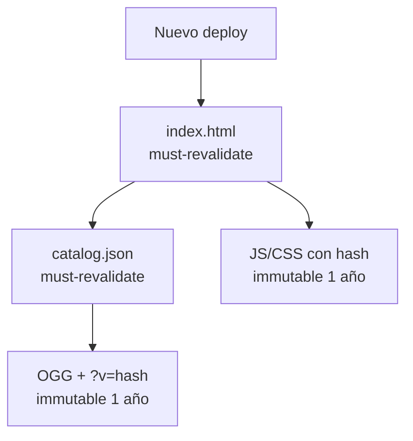

# Infraestructura de Cloudflare

Cloudflare R2 aloja los assets pesados y Cloudflare Pages publica el arcade.
Ambos se despliegan independientemente.

## Recursos actuales

- Pages: `phaser-arcade`.
- URL estable: `https://phaser-arcade.pages.dev/`.
- Bucket: `phaser-arcade-assets`.
- Clase de almacenamiento: Standard.
- Acceso temporal: subdominio público `r2.dev` definido en
  `audio-assets.json`.
- CORS: lectura pública `GET`/`HEAD`, soporte para `Range` y exposición de los
  encabezados necesarios para audio.



## Archivos de configuración

- `audio-assets.json`: bucket, URL pública y carpeta fuente local.
- `r2-cors.json`: política CORS versionada.
- `scripts/upload-audio-r2.mjs`: subida paralela mediante Wrangler.
- `scripts/generate-audio-catalog.mjs`: catálogo con URLs públicas.

Ninguno contiene secretos. Wrangler guarda el OAuth cifrado mediante el
Administrador de credenciales de Windows.

## Comandos

```bash
npx wrangler whoami
npx wrangler r2 bucket info phaser-arcade-assets
npx wrangler r2 bucket cors list phaser-arcade-assets
npm run audio:upload:r2
npm run audio:catalog
npm run deploy:pages
```

El cargador aplica a cada OGG:

- `Content-Type: audio/ogg`;
- `Cache-Control: public, max-age=31536000, immutable`;
- clave `audio/<ruta relativa local>`.

Subir un archivo con la misma ruta reemplaza el objeto existente. Como la caché
es inmutable, el catálogo agrega `?v=<hash SHA-256>` a cada URL. Si cambia un
byte del OGG, cambia su URL efectiva y navegador/CDN descargan la versión nueva
sin purgar la anterior.

## Política de caché



- Pages reemplaza el despliegue de forma atómica.
- HTML y catálogo revalidan para descubrir referencias nuevas.
- Vite cambia el nombre de JS/CSS cuando cambia su contenido.
- El generador cambia el parámetro `v` cuando cambia un OGG.
- No se purga caché durante un despliegue normal.
- Una purga manual queda reservada para errores de configuración o contenido
  sensible servido por una URL ya publicada.

## Paso pendiente para el CDN de audio

`r2.dev` está pensado para desarrollo y puede ser limitado por Cloudflare. Para
el CDN de producción hay que conectar un dominio propio, por ejemplo
`assets.example.com`, activar caché y reemplazar `publicBaseUrl` en
`audio-assets.json`. No se requiere mover ni volver a subir los objetos.
