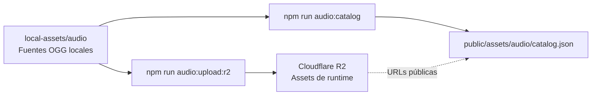

# Biblioteca de audio

Esta carpeta forma parte del build, pero ya no contiene los archivos OGG. Sólo
publica el catálogo liviano y las licencias originales:

```text
public/assets/audio/
├── catalog.json
├── README.md
└── licenses/
```

Los 213 audios catalogados viven en el bucket Cloudflare R2
`phaser-arcade-assets`. Las fuentes locales se conservan bajo
`local-assets/audio`, carpeta ignorada por Git y por Vite.



## Fuentes y licencias

Los packs instalados actualmente declaran licencia **CC0**:

- Música: Abstraction / Tallbeard Studios, bundles 2026 Q1 y 2026 Q2.
- Efectos: Kenney, packs Interface Sounds y UI Audio.

Las copias versionadas de `_LICENSE.txt`, `License.txt` y los README originales
están en `licenses`. Otra copia permanece junto al pack local. No deben borrarse
aunque la licencia también aparezca resumida en el catálogo.

## Agregar audio

1. Descomprimir el pack bajo `local-assets/audio/music/<autor>/<colección>` o
   `local-assets/audio/sfx/<autor>/<colección>`.
2. Conservar su licencia y documentación originales y copiar su licencia a
   `public/assets/audio/licenses`.
3. Usar OGG para reproducción en el juego.
4. Registrar la colección en `scripts/generate-audio-catalog.mjs`.
5. Ejecutar `npm run audio:upload:r2`.
6. Ejecutar `npm run audio:catalog`.
7. Abrir el Jukebox y verificar reproducción, volumen y URL.

La URL y el bucket se definen en `cloudflare/audio-assets.json`. El dominio
`r2.dev` actual es temporal; cuando exista un dominio propio sólo habrá que
cambiar `publicBaseUrl`, regenerar el catálogo y volver a validar.

Cada URL del catálogo termina con `?v=<hash-del-contenido>`. Este parámetro es
parte de la clave de caché: reemplazar un OGG y regenerar el catálogo produce
una URL nueva, aunque la ruta legible del objeto no cambie. Por eso es seguro
servir los OGG con caché inmutable durante un año.

Los ZIP de descarga y `local-assets` son fuentes locales: no se versionan ni se
incluyen en `dist`.
