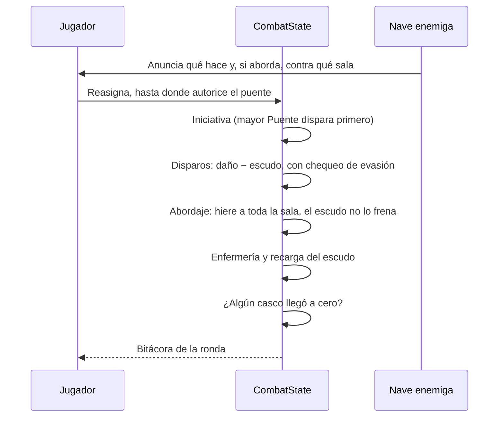
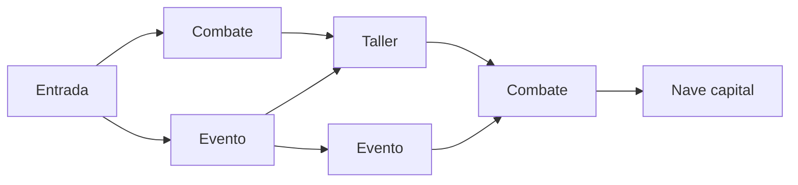
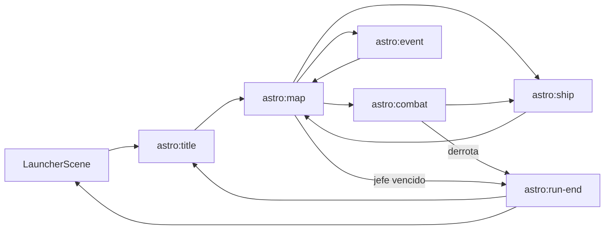

# Astro Chess

Roguelite de administración de nave donde la tripulación son piezas de ajedrez.
El ajedrez no es un minijuego adentro del juego: es el idioma con el que están
escritas las reglas. Cada pieza rinde distinto según la sala, arrastra las
restricciones de su movimiento original y puede promocionar.

## Qué hay hoy

Las fases 0, 1 y 2 del plan: se puede repartir la tripulación y pelear un
combate entero contra el corsario.

- Módulo, claves con prefijo `astro:` y manifiesto en el catálogo, con portada
  propia en el launcher.
- Pantalla de título que presenta a las seis piezas con su rasgo.
- Plano de la nave con sus cinco salas, sus siete puestos y el damero de
  colores de casilla.
- Asignación de tripulantes por click, con la aptitud de la pieza elegida
  anticipada en cada puesto y el rendimiento de cada sala en vivo.
- Combate por rondas contra el corsario, con intención anunciada, heridas,
  bitácora y los dos finales.
- Una interfaz pensada para mostrar las consecuencias antes de decidir (ver
  [Interfaz](#interfaz)).
- Estado en `state/`, sin Phaser adentro: `Crew`, `Ship`, `Combat` y el azar con
  semilla.

Dos decisiones que tomó esta fase y que no estaban en el plan original:

- **La tripulación inicial no tiene reina.** Empieza con rey, torre, alfil,
  caballo y peón. La pieza más poderosa se gana promocionando o reclutando, y
  ésa es la zanahoria de la campaña.
- **Se levanta y se deja.** Tocar un puesto ocupado levanta a quien esté ahí en
  vez de mandarlo al banco: mover gente entre salas es lo que más se hace y
  tiene que salir en dos clicks.

Lo que todavía no está: rasgos de las piezas, jaque, enroque, promoción, mapa,
eventos y muerte permanente. Las heridas duran lo que dura el combate.

## Interfaz

La única decisión del jugador es dónde está cada pieza. La primera versión de
las pantallas mostraba el estado, pero no qué cambiaba cada decisión: para
saberlo había que hacer la cuenta de cabeza o leer la bitácora después de la
ronda. La regla que ordena la interfaz es que **toda consecuencia se ve antes
de decidir**.

| Lo que el jugador necesita saber | Dónde lo ve |
| --- | --- |
| Qué rinde una pieza en cada puesto | `×0/×1/×2` dentro de cada puesto mientras la tiene en la mano. |
| Qué le pasa a la nave si la pone ahí | `DAÑO 0→4` en cada sala, con la mejor posición posible. |
| Qué hace cada sala | Ayuda al pasar el mouse, con el color de su casilla. |
| Qué amenaza el enemigo | La sala marcada en el plano: la abordada, o los escudos si no alcanzan. |
| Cómo termina la ronda | `SI RESOLVÉS AHORA` y la pérdida pronosticada en rojo sobre las barras. |
| Cuántas piezas puede mover | Fichas de movimiento; las piezas que no pueden moverse llevan candado. |
| Por qué no puede mover a alguien | Un aviso con el motivo y cómo se arregla. |
| Por qué perdió | El golpe que más casco se llevó, en la pantalla final. |

Algunas decisiones de implementación:

- **El pronóstico es el combate.** `Combat.forecast()` juega la ronda sobre
  copias de la tripulación y la nave, con un azar que nunca sale
  (`Rng.certain()`), y devuelve las mismas líneas que escribiría la bitácora.
  No hay una segunda implementación de las reglas que pueda desincronizarse. La
  evasión se informa aparte, como probabilidad.
- **La ronda se resuelve entera y se muestra de a poco.** El estado cambia en el
  acto; la escena reproduce la bitácora línea por línea, con trazos, números que
  suben y el plano que destella. Las barras parten de cómo estaban antes de la
  ronda y cada paso aplica lo que dice su línea. Enter la saltea.
- **Tres formas de repartir, una sola regla.** Click y click, arrastrar y
  soltar, o flechas y espacio terminan en el mismo `activate` de `CrewBoard`.
  Los clicks se resuelven por geometría, no con eventos por objeto, para que el
  arrastre y el teclado compartan la misma noción de "qué hay acá".
- **Reintentar conserva el reparto.** La pantalla de puestos recibe el
  `ShipLayout` con el que empezó el combate: corregir una decisión es mucho más
  rápido que rehacer todas.
- **Avisos antes del combate.** Sin nadie en la armería la derrota es segura, así
  que el primer Enter avisa y el segundo confirma. La falta de puente o de
  escudos se avisa sin bloquear.

**El resto de este documento es el plan, no el estado actual.**

## Lo que enseñó simular el combate

El combate no importa Phaser, así que se lo puede compilar aparte y jugar
cientos de partidas sin abrir el navegador. Eso encontró tres problemas que una
partida a mano no habría mostrado, y los tres cambiaron el diseño, no los
números.

### El escudo se recarga entero

Con regeneración parcial, **atacar le ganaba a defender en cualquier
combinación de números**: acortar el combate evitaba más daño del que alcanzaba
a absorber un escudo que tardaba tres rondas en llenarse. Subirle el daño o el
casco al enemigo no cambiaba nada, sólo hacía todo más difícil.

Ahora el escudo vuelve a su capacidad al final de cada ronda: la capacidad *es*
lo que la nave aguanta por ronda. Poner gente en escudos pasó a valer tanto como
ponerla en la armería, y el disparo cargado del enemigo tiene sentido porque es
lo único más grande que un escudo lleno.

### Sólo el abordaje hiere, y anuncia sala

La primera versión hacía que cada disparo que pasara el escudo hiriera también a
la sala apuntada. Duró una simulación: cada herida bajaba el escudo, lo que
dejaba pasar el disparo siguiente, que hería otra vez. La partida se decidía en
la ronda dos y la tasa de victoria de un reparto sensato caía del 74 % al 14 %.

Ahora cada intención tiene su propia respuesta:

| El enemigo anuncia | La respuesta |
| --- | --- |
| Disparar | Tener escudo. |
| Cargar | Tener más escudo justo esa ronda. |
| Abordar *(sala)* | Vaciar esa sala, y perder lo que produce por una ronda. |
| Escudarse | Empujar el daño mientras no ataca. |

El abordaje además **barre la sala entera**: hiere a todos los que encuentre.
Con una sola herida por abordaje, esquivarlo no compensaba perder la producción
de la sala durante la ronda.

### El puente decide cuántas piezas se mueven

Dos repartos idénticos salvo por dónde estaba el rey daban 51 % y 92 % de
victorias. El rey en la enfermería ganaba; el rey en el puente no servía para
nada, porque la iniciativa sólo decidía quién disparaba primero.

El puente ahora produce **movimientos por ronda**: es lo que autoriza a
reorganizar la nave. Sin nadie al mando, la nave entra en combate con el reparto
que traía y se lo aguanta. Con el rey ahí, dos piezas por ronda pueden dejar su
puesto.

Es el cambio que le da sentido al bucle entero: reaccionar a lo que el enemigo
anuncia vale entre **14 y 39 puntos de victoria**, y esa ventaja pasa toda por
el puente.

### Dónde quedó el balance

El corsario tiene casco 18 y daño 7. Con la tripulación inicial:

| Jugador | Victorias |
| --- | --- |
| Reparte bien y no vuelve a tocar nada | ~50 % |
| Reparte bien y reacciona a cada anuncio | ~89 % |
| Deja la armería vacía | 0 % |

Un primer enemigo tiene que ser así: se lo gana prestando atención y se lo puede
perder por no prestarla.

## Decisiones de diseño

Cinco definiciones que ordenan todo lo demás. Están acá arriba porque cambiarlas
después implica reescribir el módulo, no ajustar números.

| Decisión | Elegida | Por qué |
| --- | --- | --- |
| Combate | Por rondas | El ajedrez es por turnos. Además se resuelve sin animar nada y se puede probar sin renderizar. |
| Alcance del MVP | Un sector completo | Ocho nodos jugables de punta a punta en diez minutos. Valida el núcleo antes de invertir en contenido. |
| Arte | Primitivas de Phaser | Mismo camino que Pipes y Truco: cero pipeline de assets y el arte se reemplaza después sin tocar la lógica. |
| Energía del reactor | **Fuera del MVP** | Repartir energía *y* repartir piezas son dos economías compitiendo. La escasez interesante ya la dan las piezas: hay más salas que tripulación. |
| Azar | PRNG con semilla propia | Un roguelite necesita poder repetir una partida para reproducir un problema de balance. `Math.random()` no lo permite. |

La decisión de sacar el reactor es la única que contradice al concepto inicial.
El motivo es concreto: si el jugador puede compensar una asignación mala subiendo
energía, la matriz de aptitudes deja de decidir la partida y el ajedrez se
vuelve decorativo. El reactor entra en la fase 6, cuando la asignación ya
demostró sostener el combate sola.

## El ajedrez como lenguaje

### Aptitudes

Cada sala produce un efecto base y la pieza asignada lo multiplica por su
aptitud: `0` no aporta nada, `1` cumple, `2` es especialista.

| Pieza | Puente | Escudos | Armería | Motores | Enfermería |
| --- | --- | --- | --- | --- | --- |
| Rey | 2 | 1 | 1 | 1 | 1 |
| Reina | 2 | 2 | 2 | 2 | 2 |
| Torre | 1 | 2 | 1 | 1 | 0 |
| Alfil | 1 | 1 | 2 | 1 | 2 |
| Caballo | 1 | 0 | 1 | 2 | 0 |
| Peón | 1 | 1 | 1 | 1 | 1 |

El Peón no es malo: es exactamente normal. Su debilidad no está en la tabla sino
en que nunca es la respuesta a un problema puntual. Su fuerza está en el futuro.

### Rasgos

Las aptitudes solas darían un juego de números. Los rasgos son lo que hace que
cada pieza se juegue distinto, y todos salen de cómo se mueve en el tablero.

- **Rey** — *el rey coordina, no pelea.* Suma +1 de aptitud a las piezas de las
  salas adyacentes al Puente. Si muere, la partida termina.
- **Reina** — *se mueve en todas las direcciones.* Aptitud 2 en cualquier sala.
  A cambio, es la pieza que el enemigo prioriza al abordar.
- **Torre** — *no abandona la posición.* Mientras no se mueva, acumula +1 al
  efecto de su sala por cada ronda que lleve ahí, hasta +3. Reasignarla lo
  reinicia a cero.
- **Alfil** — *nunca cambia de color.* Cada Alfil nace claro u oscuro y las salas
  también tienen color. Fuera de su color su aptitud cae a `0`. Dos Alfiles de
  colores opuestos cubren la nave entera; dos del mismo color son medio equipo.
- **Caballo** — *salta por encima.* Es la única pieza que puede reasignarse dos
  veces en la misma ronda, y su abordaje ignora por completo el escudo enemigo.
- **Peón** — *sólo avanza.* No puede volver a una sala donde ya estuvo en este
  combate. Gana rango y promociona.

El Alfil es el rasgo que más cambia la partida: convierte reclutar en una
decisión de cobertura y no de poder, porque el segundo Alfil vale muchísimo más
o muchísimo menos según el color que traiga.

### Jaque

Cuando el casco baja del 25 % o hay abordadores en el Puente, la nave entra en
**jaque**. El jugador tiene una ronda para salir: subir el casco, restaurar el
escudo o limpiar el Puente. Si termina la ronda siguiente todavía en jaque, la
partida termina, aunque el casco no haya llegado a cero.

Es la traducción directa de la regla que define el ajedrez: no perdés cuando te
comen el rey, perdés cuando no podés evitar que te lo coman.

### Enroque

Una vez por combate, el Rey y una Torre intercambian sala en el acto y la Torre
entrega un escudo temporal. Condición, igual que en el tablero: **ninguno de los
dos puede haberse movido** en lo que va del combate. Es una carta guardada que
premia haber dejado a la Torre quieta, que es justo lo que su rasgo ya pedía.

### Promoción

El Peón suma un rango por cada combate que sobrevive habiendo estado asignado a
una sala que aportó. A los cinco rangos —las cinco filas que le faltan para
cruzar el tablero— el jugador elige en qué se convierte: Reina, Torre, Alfil o
Caballo. Si elige Alfil, elige también su color.

La promoción se resuelve en la nave, después del combate, para que sea una
decisión mirando la tripulación completa y no una interrupción del combate.

## La nave

Cinco salas en el MVP, cada una con uno o dos puestos. La vista principal es
siempre el plano de la nave.

| Sala | Color | Puestos | Qué produce |
| --- | --- | --- | --- |
| Puente | Claro | 1 | Iniciativa y precisión. |
| Escudos | Oscuro | 2 | Puntos de escudo y su regeneración por ronda. |
| Armería | Claro | 2 | Daño y velocidad de recarga. |
| Motores | Oscuro | 1 | Evasión y posibilidad de huir. |
| Enfermería | Claro | 1 | Cura una pieza herida por ronda. |

Siete puestos y una tripulación inicial de cinco piezas: el jugador nunca puede
tener todo cubierto. Ésa es la decisión central de cada ronda.

Las piezas no caminan. Se arrastran o se clickean de un puesto a otro y el cambio
es instantáneo, salvo por el límite de una reasignación por ronda y por pieza
—dos para el Caballo—.

Una sala dañada produce menos hasta que se repare. Una pieza herida baja 1 de
aptitud; con la segunda herida queda fuera de combate, pero **no muere**. Las
piezas sólo mueren por abordaje enemigo o por eventos: perder tripulación tiene
que doler, no ser ruido de fondo.

## Combate por rondas



El jugador no tiene botones de disparar ni de escudarse. **Su única decisión es
dónde está cada tripulante**, y la armería dispara si hay alguien que sepa
hacerlo. Ése es el juego; agregarle acciones sueltas lo diluiría.

La intención del enemigo es siempre visible. Ocultarla haría el juego más
difícil, no más interesante: sin esa información, asignar piezas es adivinar.
Cuando exista la sala de Sensores, lo que se revele será *más* información —qué
tripulación tiene, qué reliquia lleva— y no la que hace jugable la ronda.

La resolución es determinística dada la semilla: mismas órdenes, mismo
resultado. Eso es lo que permite las simulaciones de más arriba.

Todavía no están el jaque, el enroque ni la muerte del rey: perder es que el
casco llegue a cero. Una pieza con dos heridas queda fuera de combate y
abandona su puesto, pero no muere.

## Campaña

Un sector de ocho nodos con ramificación, del punto de entrada a la nave
capital.



- **Combate** — dos naves enemigas distintas en el MVP más el jefe.
- **Evento** — texto y dos o tres opciones con consecuencias permanentes para
  esa partida: chatarra, heridas, una pieza nueva, una pieza perdida.
- **Taller** — reparar casco, reclutar una pieza o mejorar el nivel base de una
  sala.

Un solo recurso: **chatarra**. Sin combustible ni munición en el MVP; un recurso
que sólo se puede gastar en tres cosas ya obliga a elegir.

## Reliquias

Objetos que cambian una regla, no un número. Tres alcanzan para el MVP, elegidas
para que cada una rompa un rasgo distinto:

| Reliquia | Efecto |
| --- | --- |
| Diagonal invertida | Los Alfiles rinden en ambos colores. |
| Salto corto | Los Caballos abordan sin gastar la ronda. |
| Coronación temprana | Los Peones promocionan a los tres rangos. |

## Estética

Siluetas geométricas, paleta holográfica, cero imágenes. Cada pieza es una forma
reconocible a primera vista y a cualquier escala.

| Pieza | Silueta | Color |
| --- | --- | --- |
| Rey | Triángulo sobre base | Dorado |
| Reina | Rombo sobre base | Violeta |
| Torre | Rectángulo almenado | Cian |
| Alfil | Ojiva | Verde |
| Caballo | Cuña angular | Naranja |
| Peón | Círculo chico | Gris |

El Alfil dibuja además un punto de su color de casilla, porque es información
que el jugador necesita en cada asignación.

## Estructura

```text
src/games/astro-chess/
├── index.ts                  # Manifiesto para el catálogo del arcade
├── sceneKeys.ts              # Claves con prefijo astro:*
├── audio.ts                  # Música y efectos propios
├── astro-chess.md
├── constants/
│   ├── pieces.ts             # Tipos, aptitudes y rasgos
│   ├── rooms.ts              # Salas, puestos, color y efectos
│   ├── enemies.ts            # Naves enemigas del sector 1
│   ├── events.ts             # Eventos, opciones y consecuencias
│   ├── relics.ts             # Reliquias y qué regla modifican
│   └── tuning.ts             # Números del balance
├── state/
│   ├── rng.ts                # PRNG con semilla
│   ├── Crew.ts               # Piezas, heridas, rangos y promoción
│   ├── Ship.ts               # Casco, salas, puestos y asignaciones
│   ├── Combat.ts             # Resolución de una ronda
│   └── RunState.ts           # Partida: mapa, nodo actual, chatarra, reliquias
├── objects/
│   ├── shipRenderer.ts       # Plano de la nave, compartido por escenas
│   ├── pieceRenderer.ts      # Siluetas, compartidas por nave y tripulación
│   ├── CrewBoard.ts          # Plano interactivo: reparto, ayudas y amenazas
│   ├── text.ts               # Traducciones con valores y líneas de bitácora
│   └── ui.ts                 # Botones y textos flotantes
└── scenes/
    ├── AstroChessTitleScene.ts
    ├── AstroChessMapScene.ts
    ├── AstroChessShipScene.ts
    ├── AstroChessCombatScene.ts
    ├── AstroChessEventScene.ts
    └── AstroChessRunEndScene.ts
```

`state/` no importa Phaser en ningún archivo. Es la regla que hace que el
combate se pueda probar y ajustar sin renderizar nada, y es la misma separación
que ya usan `PipeBoard` y `WaterFlow`.

## Flujo entre escenas



El `RunState` viaja como dato en `scene.start`, igual que el nivel y el puntaje
de Pipes. No hay estado global de partida: una partida nueva es un `RunState`
nuevo. Lo único que sí persiste en `localStorage` son preferencias del
dispositivo y, más adelante, el récord de sector alcanzado.

## Plan de implementación

Cada fase termina con algo jugable y con `npm run build` en verde.

| Fase | Qué entrega | Cómo se prueba |
| --- | --- | --- |
| 0 | Módulo, claves, manifiesto, portada en el launcher, i18n mínimo, título que vuelve al arcade. | El juego aparece en el catálogo y abre. |
| 1 | `Crew`, `Ship`, plano de la nave y asignación de piezas por click. Sin combate. | Se puede armar la tripulación y ver cómo cambian los efectos de cada sala. |
| 2 | `Combat`: rondas, disparos, escudos, evasión, heridas y bitácora contra un enemigo fijo. | Se gana o se pierde un combate completo. |
| 3 | Mapa del sector, eventos, chatarra, taller y reclutamiento. | Partida entera de punta a punta. |
| 4 | Rasgos completos: colores del Alfil, salto del Caballo, guardia de la Torre, aura del Rey, jaque, enroque y promoción. | El ajedrez se nota en las decisiones, no sólo en los nombres. |
| 5 | Reliquias, jefe, audio, pulido y esta documentación al día. | El MVP está cerrado. |
| 6 | Energía del reactor, Sensores, Hangar, pantalla de configuración estilo Pipes. | Después de validar el núcleo. |

Las fases 0 y 1 tocan `core`: hay que sumar `'astro-chess'` al union `coverType`
de `gameCatalog.ts` y dibujar su portada en `LauncherScene`. Es el único cambio
fuera del módulo.

## Riesgos conocidos

- **Volumen de i18n.** Los eventos son texto y hay que escribirlos completos en
  español e inglés. Es el trabajo de contenido más grande del juego; conviene
  cerrar el formato de evento en la fase 3 con pocos casos antes de escribir
  veinte.
- **Escenas que crecen.** `AstroChessCombatScene` es candidata a pasarse de las
  700 líneas. El render del plano y de las piezas vive en `objects/` desde el
  primer día justamente por eso.
- **Balance sin herramientas.** Sin la pantalla de configuración, ajustar
  números es recompilar. Si en la fase 4 el balance empieza a comer tiempo, se
  adelanta el `tuningStore` de la fase 6.
- **Demasiadas reglas juntas.** Los rasgos son deliberadamente la fase 4 y no la
  1: si el combate no es interesante con aptitudes planas, agregarle rasgos lo
  hace confuso, no divertido.

## Fuera del MVP

Tripulación caminando por la nave, incendios, brechas de casco, drones,
animaciones de combate, cinemáticas, más sectores, más piezas enemigas y
tableros de ajedrez reales en cualquier forma. El último punto es explícito: si
en algún momento aparece un minijuego de ajedrez, el concepto se rompió.
