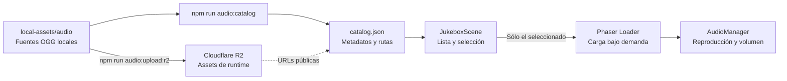

# Jukebox

Jukebox es un juego-herramienta para explorar la biblioteca de audio desde el
mismo entorno de Phaser. Permite escuchar una pista o efecto, ajustar volúmenes
y copiar la ruta exacta que otro juego debe cargar.

Actualmente muestra **62 pistas musicales** y **151 efectos**.

## Flujo y arquitectura



Al entrar se descarga únicamente `catalog.json`, no los 220 audios alojados en
R2. Cuando el
jugador elige **Oír**, la escena agrega el archivo seleccionado al loader de
Phaser y espera su evento de finalización. Esto reduce la carga inicial y deja
el archivo en la caché para futuras reproducciones.

`AudioManager` vive en `core` porque la política de audio será compartida por
todos los juegos. Sus responsabilidades son:

- mantener una sola música activa;
- reproducir efectos sin interrumpir la música;
- separar volumen de música y de efectos;
- persistir ambos volúmenes en `localStorage`;
- detener y destruir la música cuando corresponda.

La carga de cada asset sigue siendo responsabilidad de la escena que lo usa.

## Controles

| Acción | Teclado / interfaz |
| --- | --- |
| Elegir asset | Flechas arriba y abajo o clic en una fila |
| Cambiar página | Flechas izquierda y derecha |
| Alternar música/efectos | Tab o clic en una pestaña |
| Reproducir | Enter o botón Oír |
| Detener | Espacio o botón Parar |
| Copiar ruta | Ctrl+C / Cmd+C o botón Copiar |
| Salir al launcher | Escape |

`Ctrl+C` escucha el evento `copy` del documento para escribir directamente la
ruta seleccionada en el portapapeles. También existe un fallback sobre
`keydown` para navegadores que no entreguen ese evento al canvas.

## Persistencia

Las preferencias se guardan con estas claves:

- `arcade.audio.musicVolume`
- `arcade.audio.sfxVolume`

Los valores van de `0` a `1`. Si `localStorage` está bloqueado, el audio sigue
funcionando con los valores por defecto: 65% para música y 80% para efectos.

## Funcionalidades implementadas

- Catálogo separado en Música y Efectos.
- Paginación de siete elementos.
- Carga dinámica y caché de archivos OGG.
- Reproducción en loop para música.
- Reproducción independiente para efectos.
- Volúmenes separados, ajustables y persistidos.
- Copia de la URL pública por botón o atajo.
- Interfaz completa en español e inglés.
- Mensajes de carga, reproducción, copia y error.
- Regreso al launcher deteniendo la música activa.

## Agregar nuevos assets

La fuente del catálogo es la biblioteca local bajo `local-assets/audio`. Después de
incorporar un pack, hay que registrar sus metadatos en el generador y ejecutar:

```bash
npm run audio:upload:r2
npm run audio:catalog
```

El JSON resultante no se edita manualmente. Los IDs se derivan de la ruta
pública, por lo que permanecen estables mientras el asset no se mueva.

La URL incluye una versión SHA-256 del contenido (`?v=...`). Si el archivo
cambia, también cambian su URL e ID de caché; Phaser, el navegador y Cloudflare
no confunden el audio anterior con el nuevo.

La conexión a R2, CORS y el dominio público están documentados en
`cloudflare/README.md`. `public/assets/audio` conserva únicamente el catálogo y
las licencias, por lo que los OGG no aumentan el tamaño de `dist`.

## Mejoras posibles

- Búsqueda por nombre, autor o colección.
- Favoritos y etiquetas para asociar audios con mecánicas.
- Visualización de duración y forma de onda.
- Crossfade entre pistas musicales.
- Exportar una selección reducida para cada juego.
