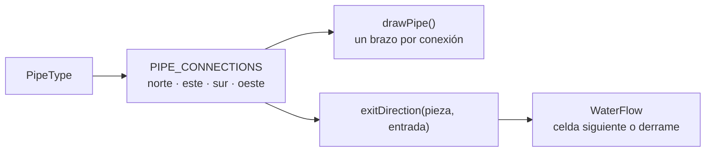
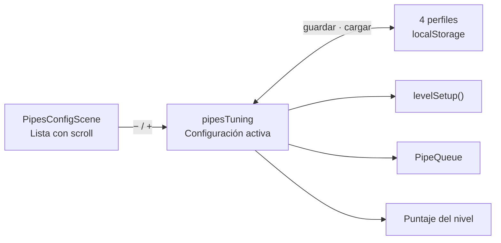
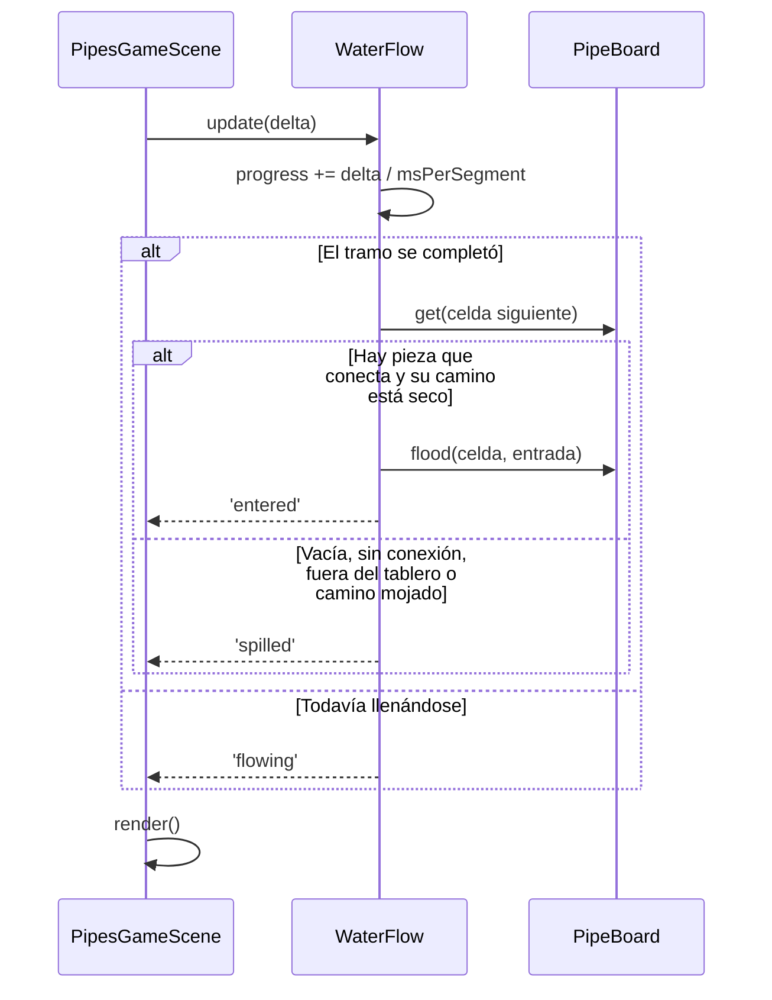
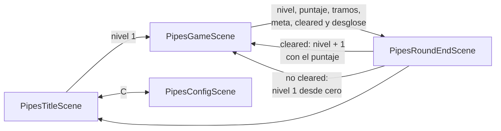

# Pipes

Versión propia de *Pipe Mania* / *Pipe Dream*. El agua arranca sola después de
una cuenta regresiva y no se detiene: la partida consiste en construir el
recorrido por delante del caudal hasta llegar a la meta del nivel.

## Qué hay hoy

- Grilla de 10 × 10 con una celda de origen sorteada en cada nivel.
- Cola de 5 piezas repartidas desde una bolsa mezclada.
- Cuenta regresiva antes de que arranque el agua.
- Agua que llena cada tramo de forma progresiva.
- Meta de tramos por nivel, con progresión de dificultad.
- Puntaje por tramo, bonus por cruces dobles y multas por reemplazar piezas o
  dejarlas sin usar, acumulado entre niveles.
- Cierre de nivel con los dos finales: superado o derramado, con el desglose del
  puntaje.
- Pantalla de configuración con perfiles: todos los números del juego, incluido
  el contenido de la bolsa, se pueden cambiar sin recompilar.

## Controles

| Acción | Mouse | Teclado |
| --- | --- | --- |
| Mover el cursor | Mover el puntero sobre la grilla | `←` `↑` `→` `↓` |
| Colocar la pieza actual | Click en una celda | `Enter` o `Space` |
| Largar o acelerar el agua | — | `F` |
| Reiniciar el nivel | Botón `R REINICIAR NIVEL` | `R` |
| Volver al menú del juego | Botón `ESC MENÚ` | `Esc` |
| Abrir la configuración | Botón `C CONFIGURACIÓN` del título | `C` |

## Reglas

- No se puede construir sobre el origen ni sobre una celda mojada. El intento se
  rechaza sin consumir la pieza de la cola.
- Una pieza seca sí se puede reemplazar, incluso con el agua ya corriendo.
- La celda que el agua está recorriendo cuenta como mojada: se bloquea al
  entrarle el agua, no al terminar de llenarse.
- El agua se corta cuando no puede seguir: celda vacía, pieza que no abre el
  borde por el que llega, borde del tablero, o un camino ya mojado. Lo último
  impide que un circuito cerrado sume tramos para siempre.
- El cruce es la única pieza que el agua puede atravesar dos veces, una por cada
  eje: es el único caso en que el recorrido se cruza consigo mismo. Cada
  travesía cuenta como un tramo.
- **El agua siempre termina cortándose: eso no es perder.** Si al cortarse el
  recorrido alcanzó la meta de tramos, el nivel está superado y se sigue al
  siguiente con el puntaje acumulado. Si no llegó, la partida vuelve al nivel 1.

## Dejar de esperar: la tecla F

Cuando ya no queda nada por construir, esperar no es jugar. `F` resuelve las dos
formas de esa espera:

- Durante la cuenta regresiva, larga el agua en el acto.
- Con el agua corriendo, la acelera (× 4 por defecto). Volver a apretar `F`
  devuelve la velocidad normal.

Acelerar no cambia el resultado: la escena le entrega más tiempo al caudal por
frame, no le cambia la velocidad al nivel. El recorrido, los tramos y el puntaje
salen exactamente iguales, sólo se ven antes. Por eso no hay razón para
penalizarlo ni para premiarlo.

## Puntaje

El puntaje no premia sólo llegar: premia cómo se llegó. Cada componente tiene su
propio número en la configuración, así que el peso de cada decisión se puede
mover sin tocar código.

| Concepto | Por defecto | Cuándo se aplica |
| --- | --- | --- |
| Puntos por tramo | +10 | Cada tramo que el agua termina de recorrer. |
| Doble uso de cruz | +25 | Cada cruce que el agua atraviesa por segunda vez. |
| Bonus por cruces | +100 | Al juntar 3 cruces dobles en el mismo nivel. |
| Multa por reemplazo | −5 | Cada vez que se pisa una pieza seca ya colocada. |
| Multa por pieza suelta | −5 | Cada pieza del tablero que el agua nunca usó. |

Las dos multas empujan en direcciones distintas: la de reemplazo castiga
improvisar sobre lo ya construido, y la de piezas sueltas castiga tirar piezas
en cualquier lado para sacárselas de encima. Las piezas sueltas sólo se pueden
contar cuando el agua se corta, así que esa multa aparece recién en el cierre
del nivel; el resto se ve en vivo en el panel lateral.

El total nunca baja de cero: las multas pueden anular un nivel malo, no dejar al
jugador en negativo.

## Progresión de dificultad

`constants/levels.ts` arma cada nivel a partir de la configuración activa. El
nivel 1 es deliberadamente lento: el juego se entiende mirándolo y recién
después empieza a apretar.

Con los valores por defecto:

| Nivel | Meta | Por tramo | Para construir |
| --- | --- | --- | --- |
| 1 | 10 tramos | 2400 ms | 12 s |
| 2 | 13 tramos | 2040 ms | 11 s |
| 3 | 16 tramos | 1734 ms | 10 s |
| … | +3 por nivel | × 0,85 por nivel | −1 s por nivel |
| 12 y siguientes | +3 por nivel | 900 ms (piso) | 6 s (piso) |

La velocidad y la cuenta regresiva tienen piso; la meta crece hasta su techo, así
que la dificultad no se estanca aunque el reloj ya no baje.

## Piezas y recorrido

Una pieza se define únicamente por los bordes de la celda que conecta. De ahí
salen tanto su dibujo como el camino del agua.



| Pieza | Conecta |
| --- | --- |
| `horizontal` | este · oeste |
| `vertical` | norte · sur |
| `curveNorthEast` | norte · este |
| `curveEastSouth` | este · sur |
| `curveSouthWest` | sur · oeste |
| `curveWestNorth` | oeste · norte |
| `cross` | los cuatro bordes |

El cruce es la única pieza cuyas conexiones no forman un camino único: son dos
caminos independientes. El agua lo atraviesa derecho por el eje que le toca y
deja el otro seco, disponible para una segunda travesía.

Por eso el tablero no guarda "esta celda está mojada" sino **qué bordes usó el
agua** en cada celda, y el caudal pregunta por camino y no por celda. Un camino
queda tomado tanto por su entrada como por su salida, así que llegar de
contramano a un tramo lleno tampoco sirve. En las piezas de un solo camino el
efecto es el mismo que antes: una vez mojadas, quedan terminadas.

## La bolsa de piezas

Las piezas no se sortean de cero cada vez. Igual que el "7-bag" de Tetris, hay
una bolsa con todas las piezas adentro: se mezcla, se reparte hasta vaciarla y
recién entonces se arma una nueva. El reparto vive en la configuración y
`buildBag()` lo convierte en la bolsa expandida que reparte `PipeQueue`.

| Pieza | Por defecto |
| --- | --- |
| `horizontal` | 5 |
| `vertical` | 5 |
| Cada una de las 4 curvas | 4 |
| `cross` | 1 |
| **Total por vuelta** | **27** |

Sortear cada pieza por separado dejaba pasar rachas absurdas: seis rectas
seguidas justo cuando hacía falta doblar, con el agua encima. Con la bolsa, en
cada vuelta de 27 piezas salen exactamente 16 curvas.

Ese mismo reparto es el que hace que el cruce sea casi anecdótico: una cruz cada
27 piezas obliga a construir un circuito larguísimo antes de poder plantear el
segundo cruce, y eso suponiendo que la siguiente cruz llegue enseguida. Por eso
la bolsa es lo primero que se puede tocar desde la configuración.

Encima de la bolsa hay un tope: nunca se reparten más de tres piezas seguidas
que no hagan doblar el agua (`MAX_STRAIGHT_RUN` en `PipeQueue`). Al alcanzarlo,
se adelanta la próxima curva de la bolsa. Eso sólo cambia el orden, no el
contenido; si a la bolsa ya no le quedan curvas, se mezcla la siguiente y se
toma de ahí, así que el tope se respeta siempre.

El panel lateral muestra cuántas piezas quedan en la bolsa. No es sólo
información: hace visible que las piezas salen de un conjunto conocido y no de
la nada.

## Configuración y perfiles

La pantalla de configuración se abre desde el título con `C` y existe por una
razón concreta: probar un balance no debería requerir editar constantes,
recompilar y volver a jugar hasta el nivel donde se notaba el problema.



`constants/tuning.ts` declara los grupos, los límites y el paso de cada
parámetro. La escena no dibuja una fila por campo escrita a mano: recorre esa
declaración, así que agregar un parámetro nuevo es agregarlo ahí y nada más.

Qué se puede ajustar:

- **Tiempo para construir**: inicial, delta por nivel y mínimo.
- **Velocidad del agua**: tiempo por pieza, delta por nivel (como porcentaje que
  queda), mínimo y cuánto acelera la tecla `F`.
- **Meta de tramos**: inicial, delta por nivel y máximo.
- **Puntos y multas**: puntos por segmento, multa por reemplazo y multa por
  pieza suelta.
- **Cruces**: puntos por doble uso, cuántos cruces dobles activan el bonus y
  cuántos puntos da.
- **Bolsa**: un submenú con las siete piezas, su cantidad, el porcentaje que
  representan y el total por vuelta.

Detalles de la pantalla:

- La lista no entra en pantalla y va a seguir creciendo, así que se dibuja con
  una **segunda cámara** recortada al visor. Se desplaza con la rueda, con las
  flechas o arrastrando la barra lateral, que sólo aparece si hay algo fuera de
  la vista. Desplazar mueve la cámara, no la lista.
- La primera versión usaba una máscara y estuvo mal: una máscara recorta el
  dibujo pero no las zonas sensibles al mouse, así que los botones scrolleados
  fuera del visor seguían respondiendo a los clicks. Una cámara con viewport
  recorta las dos cosas, porque Phaser sólo prueba los objetos que la cámara
  bajo el puntero puede dibujar.
- Cada cámara dibuja todo lo que no ignora: hay que decirle a la principal que
  se saltee la lista y a la del visor que se saltee el resto de la pantalla.
- `Shift + click` mueve diez pasos de una vez.
- Un cambio rechazado por el tope del campo suena distinto a uno aceptado.
- La bolsa nunca puede quedar vacía: la última pieza no se puede sacar.

Los perfiles son cuatro ranuras fijas, no nombres libres: alcanzan para comparar
variantes mientras se ajusta el juego y evitan pedir texto dentro del canvas. La
acción que ejecuta tocar una ranura —cargar, guardar o borrar— se elige con los
botones de abajo, así una sola fila de ranuras sirve para las tres cosas.

Todo se guarda en `localStorage`:

- `pipes.tuning`: la configuración activa.
- `pipes.tuning.profiles`: las cuatro ranuras.

Lo guardado nunca se usa tal cual. `normalizeTuning()` parte de los valores por
defecto y acepta sólo lo que cae dentro de los límites de cada campo, así que un
JSON viejo, incompleto o corrupto no rompe el juego: en el peor caso se juega
con los valores de fábrica.

La configuración se lee en `init()` de la partida y no en cada uso: cambiarla a
mitad de un nivel haría que se termine jugando con reglas distintas a las que
empezó.

## Estado y representación

El estado real vive en tres clases sin Phaser adentro:

- `PipeBoard`: qué pieza hay en cada celda, por qué bordes entró el agua y dónde
  está el origen. Las entradas son una lista por celda: el dibujo las necesita
  para saber qué brazos pintar, y el cruce puede tener dos.
- `PipeQueue`: cola de piezas y la bolsa de la que salen, con `current`,
  `preview`, `shift` y `remainingInBag`.
- `WaterFlow`: la cabeza del caudal, con su celda, borde de entrada y progreso.
  Su velocidad llega por constructor porque la define el nivel, no el caudal.

La escena no guarda una copia paralela del tablero. Cada vez que algo cambia,
`render()` vacía los `Graphics` y los vuelve a dibujar a partir del estado. Es
más simple que mantener sincronizados cien objetos visuales y hace que las
reglas se puedan probar sin renderizar nada.



## Flujo entre escenas

El nivel y el puntaje acumulado viajan como datos de `scene.start`. La escena de
partida no guarda nada entre niveles: los recibe en `init` y, al terminar, los
entrega al cierre de nivel.



La configuración no viaja como dato entre escenas: vive en `pipesTuning` y cada
escena la lee al arrancar. Es una preferencia del dispositivo, como el idioma o
el volumen, no el resultado de una partida.

## Estructura

```text
src/games/pipes/
├── index.ts               # Manifiesto para el catálogo del arcade
├── sceneKeys.ts           # Claves con prefijo pipes:*
├── audio.ts               # Música y efectos propios
├── tuningStore.ts         # Configuración activa y perfiles guardados
├── pipes.md
├── constants/
│   ├── pipeTypes.ts       # Piezas, conexiones, recorrido y armado de la bolsa
│   ├── levels.ts          # Meta, velocidad y cuenta regresiva por nivel
│   └── tuning.ts          # Parámetros ajustables, límites y valores por defecto
├── objects/
│   ├── PipeBoard.ts       # Estado de la grilla
│   ├── PipeQueue.ts       # Cola de piezas y bolsa
│   ├── WaterFlow.ts       # Avance del agua y cruces dobles
│   └── pipeRenderer.ts    # Dibujo compartido por tablero, cola y configuración
└── scenes/
    ├── PipesTitleScene.ts
    ├── PipesGameScene.ts
    ├── PipesRoundEndScene.ts
    └── PipesConfigScene.ts
```

## Próximos pasos

1. Obstáculos en la grilla y celdas donde no se puede construir.
2. Guardar el mejor puntaje y el nivel más alto en `localStorage`.
3. Aviso visual cuando el agua está por alcanzar el final de lo construido.
4. Poder nombrar los perfiles, si cuatro ranuras numeradas quedan cortas.
