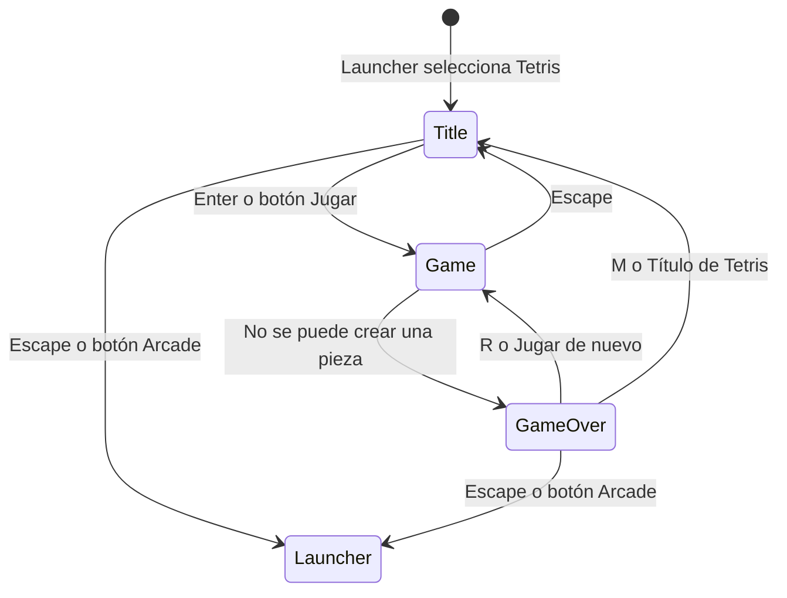
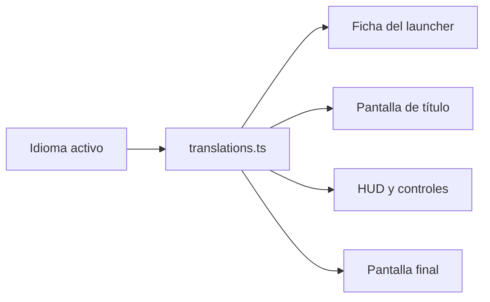
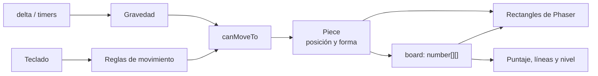
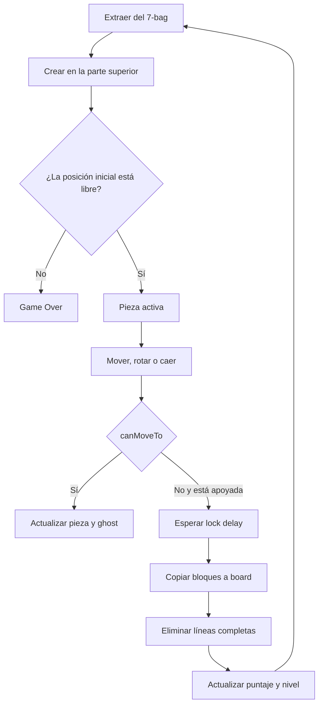

# Tetris: diseño técnico y funcionalidades

Este documento describe la implementación actual de Tetris. Debe actualizarse
cuando cambien controles, reglas, balance, escenas o funcionalidades.

## Flujo de escenas

Tetris es un módulo con tres escenas registradas desde su manifiesto `index.ts`.



Claves de escenas:

| Escena | Clave | Responsabilidad |
| --- | --- | --- |
| `TetrisTitleScene` | `tetris:title` | Presentación, controles e inicio |
| `TetrisGameScene` | `tetris:game` | Partida, input, reglas y renderizado |
| `TetrisGameOverScene` | `tetris:game-over` | Resultado y navegación posterior |

## Controles

### Partida

| Entrada | Acción |
| --- | --- |
| Flecha izquierda | Mover una celda a la izquierda |
| Flecha derecha | Mover una celda a la derecha |
| Flecha arriba | Rotar 90 grados |
| Flecha abajo | Caída suave |
| Espacio | Caída rápida y bloqueo inmediato |
| P | Pausar o reanudar la partida |
| Escape | Volver al título de Tetris |

### Pantallas

| Pantalla | Entrada | Acción |
| --- | --- | --- |
| Título | Enter | Comenzar partida |
| Título | Escape | Volver al launcher |
| Game Over | R | Jugar nuevamente |
| Game Over | M | Volver al título |
| Game Over | Escape | Volver al launcher |

Todas las acciones principales también tienen botones interactivos para mouse.

## Internacionalización

Todos los textos visibles de Tetris están disponibles en español e inglés. Las
escenas no contienen copias traducidas: solicitan cada texto al servicio central
mediante claves con prefijo `tetris.*`.



La selección se realiza en el launcher y se conserva en `localStorage` con la
clave `arcade.locale`. Al entrar en Tetris, cada escena se dibuja usando el
idioma activo. Para agregar un texto nuevo se deben agregar a la vez sus
versiones española e inglesa; TypeScript valida que ninguna clave quede ausente.

## Audio

Los cinco audios iniciales de Tetris se declaran en `audio.ts`, dentro del
módulo del juego. Las escenas los cargan bajo demanda con `preload` y usan
`AudioManager` para respetar los volúmenes persistidos del arcade.

| Momento | Audio |
| --- | --- |
| Pantalla de título | `Freefall GLIDE` en loop |
| Partida | `Freefall WHAT A VIEW` en loop |
| Confirmar una opción o hacer clic en un botón | `confirmation_001` |
| Limpiar una o más líneas | `minimize_006`, una vez por limpieza |
| Limpiar cuatro líneas (Tetris) | `maximize_006` |
| Subir de nivel | `drop_004` |
| Pausar o reanudar | `switch1` |
| Llegar a Game Over | `error_003` |

La música se detiene al salir de cada escena para que no continúe en el
launcher ni se superponga con la de la siguiente pantalla. Las URLs usan el
versionado de contenido de R2 (`?v=...`), por lo que un reemplazo futuro del
archivo no deja al juego con una versión en caché equivocada.

### Criterio de densidad sonora

No hay sonido al mover lateralmente, caer una celda, rotar o mostrar la pieza
fantasma: son acciones muy frecuentes y sonarían mecánicas. Buenos próximos
candidatos, si se implementan, son pausar/reanudar, activar Hold, subir de nivel
y lograr un Tetris (cuatro líneas), siempre con un efecto breve y distinto.
Evitaría sonido por cada bloque fijado hasta probar que aporta ritmo sin cansar.

### Pausa y reducción de música

La tecla `P` y el botón de pausa congelan las actualizaciones de input, gravedad
y timers de la partida, pero mantienen activa la escena para poder recibir la
misma tecla al reanudar. La capa visual de pausa se dibuja por encima del
tablero. Al pausar, `AudioManager` reduce la música al 35 % del volumen elegido
por el jugador; no modifica la preferencia guardada y la restaura al reanudar.

Una limpieza de cuatro líneas usa `maximize_006`; las de una a tres conservan
`minimize_006`. `drop_004` suena únicamente cuando el nivel cambia, después de
aplicar las líneas obtenidas.

## Modelo lógico

La partida separa el estado real de su dibujo.



### Tablero

- Tiene 10 columnas y 20 filas.
- Cada celda lógica contiene `0` cuando está libre.
- Una celda ocupada contiene el color hexadecimal de su pieza.
- Cada celda visual mide 24 píxeles.
- `board` es la fuente de verdad para límites, colisiones y líneas completas.
- `boardBlocks` contiene sólo los rectángulos usados para representarlo.

### Pieza

`Piece` no hereda de un Game Object de Phaser. Es una clase lógica con:

- tipo de tetrominó;
- posición `x` e `y` dentro del tablero;
- cuatro coordenadas relativas en `shape`;
- pivote de rotación;
- color.

`getBlocksAt` transforma coordenadas locales de la forma en coordenadas del
tablero. La escena puede así validar un movimiento antes de modificar la pieza.

### Tetrominós

Las siete definiciones viven en `constants/tetrominoes.ts`:

- `I`, `O`, `T`, `S`, `Z`, `J` y `L`.
- Cada definición contiene su forma inicial, pivote y color.
- Una pieza copia la forma al construirse para no modificar la definición
  compartida durante una rotación.

## Ciclo de una pieza



## Mecánicas implementadas

### Bolsa de siete piezas

Se utiliza un sistema `7-bag`:

1. Se cargan una vez los siete tipos.
2. Phaser mezcla el array.
3. Las piezas se extraen hasta vaciarlo.
4. Recién entonces se crea otra bolsa.

Esto reduce secuencias extremadamente injustas y garantiza que cada grupo de
siete extracciones contenga todos los tetrominós.

### Movimiento horizontal

- El primer movimiento ocurre inmediatamente al presionar la tecla.
- Demora inicial antes de repetir: 170 ms. Tiene que superar lo que dura un
  toque normal de tecla (~100 ms); si no, un toque mueve dos celdas.
- Intervalo de repetición: 70 ms.
- Presionar izquierda y derecha al mismo tiempo no mueve la pieza.

Este comportamiento equivale conceptualmente a DAS y ARR en implementaciones
más completas de Tetris.

### Rotación

- La fórmula `(-y, x)` rota cada bloque 90 grados alrededor de su pivote.
- La pieza `O` no cambia al rotar.
- La rotación sólo se confirma si todas las celdas resultantes son válidas.
- Todavía no se implementan wall kicks ni el sistema SRS completo.

### Gravedad y niveles

- Intervalo inicial de gravedad: 500 ms.
- Cada nivel reduce 40 ms.
- Intervalo mínimo: 80 ms.
- Cada nivel requiere 10 líneas acumuladas.
- El cálculo usa `delta`, por lo que no depende de los FPS.

Fórmula actual:

```text
nivel = floor(líneas / 10) + 1
gravedad = max(80, 500 - (nivel - 1) * 40)
```

### Caídas y bloqueo

- Caída suave: un movimiento cada 50 ms mientras se mantiene flecha abajo.
- Caída rápida: Espacio lleva la pieza a la última fila válida y la bloquea.
- Lock delay: 500 ms cuando la gravedad encuentra la pieza apoyada.
- Mover o rotar una pieza apoyada reinicia el temporizador de bloqueo.

### Ghost piece

La pieza fantasma simula la caída vertical sin modificar la pieza real. Se
dibuja con el mismo color y una opacidad de `0.25`.

### Próxima pieza

La siguiente pieza se crea por adelantado y se muestra en el panel `NEXT`. Al
aparecer una nueva pieza, la prevista pasa a ser la actual y se genera otra.

### Limpieza de líneas

Una fila está completa cuando no contiene ninguna celda con valor `0`.
Las filas completas se eliminan y se agregan filas vacías en la parte superior
para conservar las 20 filas del tablero.

### Puntaje

| Líneas simultáneas | Puntos base |
| ---: | ---: |
| 1 | 100 |
| 2 | 300 |
| 3 | 500 |
| 4 | 800 |

Los puntos base se multiplican por el nivel actual.

## Reinicio y Game Over

Una partida termina cuando la nueva pieza no puede ocupar su posición inicial.
La escena envía `score`, `lines` y `level` a `TetrisGameOverScene` mediante el
objeto de datos de `scene.start`.

Como Phaser reutiliza la instancia de `TetrisGameScene`, `resetGameState`
restablece puntaje, timers, bolsa, referencias visuales y matriz antes de cada
partida nueva.

## Funcionalidades actuales

- Launcher general del arcade.
- Pantalla de título propia.
- Siete tetrominós.
- Movimiento horizontal con repetición.
- Rotación con validación.
- Caída suave y rápida.
- Gravedad progresiva por niveles.
- Lock delay.
- Bolsa de siete piezas.
- Vista previa de la siguiente pieza.
- Ghost piece.
- Limpieza de líneas.
- Puntaje y nivel.
- Pausa con capa visual y reducción temporal de música.
- Pantalla final con estadísticas.
- Reintento y navegación entre juego, título y arcade.
- Controles mediante teclado y mouse en los menús.
- Interfaz completa en español e inglés.
- Detección del idioma del navegador y persistencia de la selección.
- Música diferenciada para título y partida, y efectos para confirmación,
  limpieza de líneas y Game Over.

## Limitaciones y posibles mejoras

Estas funcionalidades no están implementadas todavía:

- Super Rotation System y wall kicks.
- Función Hold.
- Detección de T-Spins y combos.
- Back-to-back Tetris.
- Puntaje por caída suave o rápida.
- Pausa durante la partida.
- Récord persistente.
- Partículas y animaciones de líneas.
- Configuración de controles.
- Soporte táctil.
- Tests automatizados de las reglas lógicas.

Las mejoras deben conservar la separación entre datos y renderizado. Las reglas
complejas deberían extraerse a clases o funciones lógicas antes de agregarlas
directamente a la escena.
